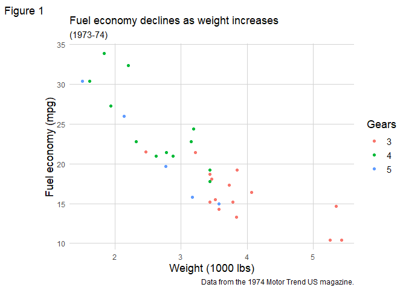

<!-- README.md is generated from README.Rmd. Please edit that file -->

# themedeltares

<!-- badges: start -->
<!-- badges: end -->

The goal of themedeltares is to add a new custom theme for ggplots in R.
The theme is based on the Deltares corporate identity, including style
and colours.

## Installation

You can install the development version of themedeltares from
[GitHub](https://github.com/) with:

``` r
# install.packages("devtools")
devtools::install_github("KeesWesdorp/theme_deltares")
```

## Example deltares_theme()

This is a basic example which shows you how to add the theme to your
plots. First we will obtain some sample data and create a standard
ggplot.

``` r
library(themedeltares)

# obtaining some sample data
mtcars2 <- within(mtcars, {
   vs <- factor(vs, labels = c("V-shaped", "Straight"))
   am <- factor(am, labels = c("Automatic", "Manual"))
   cyl  <- factor(cyl)
   gear <- factor(gear)
 })


# creating a ggplot
 p1 <- ggplot2::ggplot(mtcars2) +
  ggplot2::geom_point(ggplot2::aes(x = wt, y = mpg, colour = gear)) +
   ggplot2::labs(
     title = "Fuel economy declines as weight increases",
     subtitle = "(1973-74)",
     caption = "Data from the 1974 Motor Trend US magazine.",
     tag = "Figure 1",
     x = "Weight (1000 lbs)",
     y = "Fuel economy (mpg)",
     colour = "Gears"
   )

# Adding the deltares theme
 p1 + theme_deltares() # the default
```



``` r

# adding the deltares theme when faceting
 p2 <- p1 + ggplot2::facet_grid(vs ~ am)
 p2 + theme_deltares()
```


## deltares_colors()

All available colors

| color   | hexcode  |
|:--------|:---------|
| zwart   | \#000000 |
| blauw1  | \#080c80 |
| blauw2  | \#0d38e0 |
| blauw3  | \#0ebbf0 |
| groen1  | \#00b389 |
| groen2  | \#00cc96 |
| groen3  | \#00e6a1 |
| grijs1  | \#f2f2f2 |
| grijs2  | \#e6e6e6 |
| geel    | \#ffd814 |
| academy | \#ff960d |

List of available colorschemes

- DeltaresDefault = c(‘blauw1’, ‘blauw2’, ‘blauw3’, ‘groen1’, ‘groen2’,
  ‘groen3’)
- DeltaresFull = c(‘blauw1’, ‘blauw2’, ‘blauw3’, ‘groen1’, ‘groen2’,
  ‘groen3’, ‘academy’, ‘geel’, ‘grijs2’, ‘zwart’)
- DeltaresBlues = c(‘blauw1’, ‘blauw2’, ‘blauw3’)
- DeltaresBlues_r = c(‘blauw3’, ‘blauw2’, ‘blauw1’)
- DeltaresGreens = c(‘groen1’, ‘groen2’, ‘groen3’)
- DeltaresGreens_r = c(‘groen3’, ‘groen2’, ‘groen1’)
- DeltaresOranges = c(‘academy’, ‘geel’, ‘grijs2’)
- DeltaresOranges_r = c(‘grijs2’, ‘geel’, ‘academy’)

## examples of usages

``` r
library(themedeltares)

 deltares_colors() # default color scheme with 6 Deltares colours
#> [1] "#080c80" "#0d38e0" "#0ebbf0" "#00b389" "#00cc96" "#00e6a1"
 deltares_colors(colorscheme = "DeltaresFull") # all Deltares colours (n = 10)
#>  [1] "#080c80" "#0d38e0" "#0ebbf0" "#00b389" "#00cc96" "#00e6a1" "#ff960d"
#>  [8] "#ffd814" "#e6e6e6" "#000000"
 deltares_colors(palette = "sequential", ncolors = 10) # creates sequential color scheme with 10 colors starting with default color "blauw1" (#080c80) all the way to white (#FFFFFF)
#>  [1] "#080C80" "#23268E" "#3E419C" "#5A5DAA" "#7577B8" "#9193C6" "#ACAED4"
#>  [8] "#C8C8E2" "#E3E3F0" "#FFFFFF"
 deltares_colors(palette = "sequential", color = "blauw3", shade = "dark", ncolors = 8)  # creates sequential scheme from      blauw3(#0ebbf0) to black (#000000)
#> [1] "#0EBBF0" "#0CA0CD" "#0A85AB" "#086A89" "#065066" "#043544" "#021A22"
#> [8] "#000000"

 # Use with ggplot:

 library(ggplot2)

# create dataset
 mtcars2 <- within(mtcars, {
   vs <- factor(vs, labels = c("V-shaped", "Straight"))
   am <- factor(am, labels = c("Automatic", "Manual"))
   cyl  <- factor(cyl)
   carb <- factor(carb)
 })

 # create ggplot
  p1 <- ggplot2::ggplot(mtcars2) +
  ggplot2::geom_point(ggplot2::aes(x = wt, y = mpg, colour = carb)) +
   ggplot2::labs(
     title = "Fuel economy declines as weight increases",
     subtitle = "(1973-74)",
     caption = "Data from the 1974 Motor Trend US magazine.",
     tag = "Figure 1",
     x = "Weight (1000 lbs)",
     y = "Fuel economy (mpg)",
     colour = "Gears"
   )

 p1 + ggplot2::scale_colour_manual(values=c(deltares_colors())) # the default Deltares colourscheme
```


``` r

 # or in combination with deltares_theme()
 
 p1 + theme_deltares() + ggplot2::scale_colour_manual(values=c(deltares_colors()))
```


